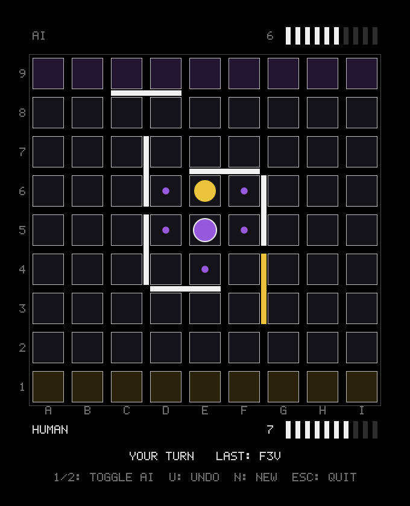

# Quoridor

The board game [Quoridor](https://en.wikipedia.org/wiki/Quoridor) in C89 with
an SDL2 frontend. Play against a friend or against a multi-threaded
alpha-beta AI, or let two AIs play each other.

<p align="center">
  
</p>

## Build and run

Requires gcc, make, SDL2 (`sdl2-config` on the PATH) and POSIX threads.

```
make          # build/quoridor, build/perft and the tests
make run      # play
make test     # run the rule, AI and perft tests
make clean
```

## Playing

Purple starts on e1 and must reach rank 9; yellow starts on e9 and must reach
rank 1. Each player has 10 walls, and purple moves first. On your turn, either
move your pawn or place a wall.

- Click a square marked with a dot to move there.
- Hover a groove between squares to preview a wall (gray = legal, red =
  illegal), and click to place it. The wall extends toward the half of the
  square the cursor is in.
- Click a seat's `HUMAN` / `AI` label, or press `1` (purple) or `2` (yellow),
  to switch who plays it. This works at any time.
- `U` / Backspace: undo (against the AI, back to your previous turn),
  `N`: new game, `Esc` / `Q`: quit.

The game starts as human (purple) against the AI (yellow).

### Rules

- Pawns move one square orthogonally.
- An adjacent opponent can be jumped straight over. If a wall or the board
  edge is behind it, the pawn may instead move diagonally to either side of it
  (unless a wall is in the way).
- Walls are two squares long, may not overlap or cross, and must leave every
  player a path to their goal row.

## AI

The AI thinks for about two seconds per move on four threads and typically
searches 16 to 20 plies deep. It uses iterative-deepening alpha-beta
(principal variation search) with a shared transposition table (Lazy SMP),
killer and history move ordering, and null-move pruning. Below the root it
only considers walls that cut one of the opponent's shortest paths. The
evaluation compares the two players' shortest paths, the walls each has left
and how much one wall could still lengthen each path.

The time budget, depth limit and thread count are fields of `qr_ai` (see
`src/ai.h`).

## Notation

Squares are `a1`..`i9`. A wall is written as its anchor square plus
orientation: `e3h` is a horizontal wall above e3 and f3, `e3v` a vertical wall
right of e3 and e4.

## Perft

`build/perft` counts the move sequences up to a given depth, to check move
generation against known totals and to time the library.

```
build/perft 3                      # depths 1 to 3 from the starting position
build/perft -m "e2 e8 e3h" 2       # play these moves first
build/perft -d 2                   # divide: the depth 2 total, split by first move
build/perft -u 4                   # apply the generated moves without validating them again
```

From the starting position:

| Depth | Nodes |
| --- | --- |
| 1 | 131 |
| 2 | 16677 |
| 3 | 2062264 |
| 4 | 247569030 |

## Layout

| File | Purpose |
| --- | --- |
| `src/quoridor.[ch]` | Game library: rules, legality, path check, notation. No SDL. |
| `src/ai.[ch]` | AI search over the library's public API. No SDL. |
| `src/atomics.[ch]` | Atomic values shared between the AI's threads; the only code using compiler extensions. |
| `src/ui.[ch]` | SDL2 rendering and input; runs the AI on a worker thread. |
| `src/font.[ch]` | Embedded 5x7 bitmap font. |
| `src/main.c` | Window and event loop. |
| `tools/perft.[ch]`, `tools/perft_cli.c` | Perft and its command line. |
| `tests/` | Rule, AI and perft tests, with no framework. |
